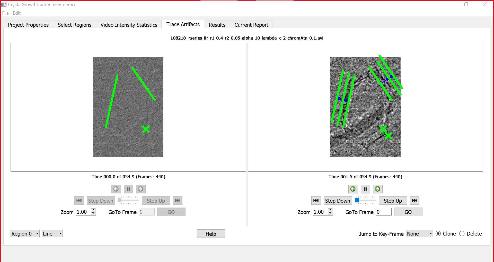

# Summary

X-ray synchrotron radiation allows the investigation of many physical processes in unprecedented ways. One application, important to the fine chemicals industry, is characterizing the early stages of crystallization.  To aid chemical engineers working in this area we developed the `CrystalGrowthTracker` package.  It allows crystals to be found in videos and their growth rates measured, see \autoref{fig:example}.  We hope that this work can provide the basis for fully automated and 3D systems.

# Statement of Need

Much of the output of global fine chemicals industries consists of crystalline powders produced by precipitation from solution.  Since the geometry of a crystal is the result of differential growth rates on different crystal planes, there is great commercial interest in studying the growth rates of crystal faces in the early stages of crystallization.  One approach is to use the X-rays of synchrotron radiation [@Baruchel2013] to produce 2D shadowgraphs of crystals precipitating onto a substrate.

Existing image analysis packages such as ImageJ, popular with scientific users, are designed for single images and does not handle video data well. For example, one of the authors, Gunjan Das, originally took eighteen months to annotate one video using ImageJ. Alternative video display and editing software is designed for entertainment and does not allow annotation and measurement of features, and some packages will not work with high resolution video.

Videos of the shadow graphs first need enhancement using packages such as Euler’s Magnifier [@Wu12Eulerian] and some statistical analysis of the raw video is desirable to find regions of interest.  `CrystalGrowthTracker` has been developed to assist in the analysis of videos of the raw and enhanced videos. The package was developed by Leng and Pickering, with specifications provided by Schroeder. Das beta tested and presented on the project [@das:bca21], [@das:isic21]. Details of the experiments can be found in [@10.1117/12.2530698], the resulting videos were shared with the developers so this data analysis software could be developed.

# Design

The obvious approach would be to use image analysis and machine learning. However the relatively noisy data, the limited number of data sets, and the need for verifiable results lead to a manual approach.  User analysis of video requires the package to have a graphical user interface (GUI). The best way to co-ordinate a GUI with the computational engine that runs in the background is through the model-view-controller (MVC) software architecture (Krasner & Pope, 1988).  Finally, users need to be able to download and run the package on any machine, so the package is developed using Python within the conda virtual environment and in the pip package management system.

The PyQt5 toolkit, from Riverbank Computing Limited [@web:riverbank], is chosen for the GUI component as it runs on any machine, is feature rich, and implements cross thread message passing using slots and signals. The latter is necessary for the complex functionality needed to play the video forwards, backwards and jump to any frame/time with and without markers and zoom.

However the Qt video player does not allow the low level access to the video stream required for this analysis, so the ffmpeg package [@web:ffmpeg] is used to access the video files in the computational engine.  A custom viewer is constructed with Qt which allows the video to be viewed in high resolution, with zoom, so markers and annotations can be viewed across the video and display how features change over time.  No effort has been made to play at the correct number of frames per second, as preserving the highest image resolution is considered paramount.

The user is able to add a marker to an image feature in a single key-frame of the video, then advance to a new key-frame and drag a clone of the marker to the feature's new locations.  The markers are graphics items augmented to hold their frame numbers and the identity of their parent.  Calculating the speeds of motion consists of ordering the chains of cloned graphics items by frame number, finding the displacements in pixel coordinates, converting the pixel distances to real distances using the scaling factor.  The pixels are assumed to be square as individual x-ray sensors in the array are square. Frame number intervals are converted to times and speeds calculated.

# Functionality

Videos documenting the \href{https://youtu.be/tjmPqGec1vs}{install}, \href{https://youtu.be/aYjkYWifw4Q}{uninstall} and \href{https://youtu.be/wYYFnPkVBrY}{operation} of the package are available on YouTube.  Sample video data is available via \href{https://doi.org/10.5281/zenodo.6801296}{Zenodo}.

The package allows the user to load two videos, raw and enhanced, and provides the following functionality:

1.  Easy install and uninstall plus availablity of a translation package.
2.  Analyse and display intensity statistics of the raw video, to assist selection of times of interest.
3.  Play enhanced video and allow the selection of regions of interest.
4.  In regions of interest allow features to be marked up on a given frame.  The markers being, lines for crystal faces, or points for other features.
5.  Change the frame of a region of interest and move the markers to follow the underlying feature.
6.  Use time and space calibration data to calculate the true speed of the marker motions.
7.  Store the above data in an open human readable format and present a report in HTML.

Project data and results are saved in comma-separated value (CSV) files using the Python csv module. CSV is a text format, which can be viewed and edited in text editors or spreadsheets, such as Excel.  The results of a project can be saved in a HTML or PDF report, which included tables, graphs and anotated video frames.

# For Developers

Some readers may wish to extend this package, for them we provide some further information on testing, source code style and documentation.

A test suite is provided, because the Python unittest module cannot run the ffmpeg subprocess, a separate test was developed for these interactions.  The Qt QTest object is used to simulate IO events, and capture the resultant signals for tesing the GUI.  The tests can be executed by adding the '-t' flag to the main cgt command line. The Python script run_test executes all tests and saves the results to a CSV file.

Doxygen is used to generate documentation from source code comments.  The code has been developed using the Pylint static code analysis tool, with a custom-made runner script. The script runs Pylint on all files, with the output displayed in the shell tool window or saved to CSV file.

# Availability
The software can be obtained from [GitHub](https://github.com/jonathanHuwP/CrystalGrowthTracker) under an Apache License.

# Acknowledgement
The authors acknowledge I13-2 beamline at DLS for the beamtime (MT20984-1) and Research Complex at Harwell for generating the test data.  Funding was provided by: the Future Continuous Manufacturing and Advanced Crystallization (CMAC) Hub (EPSRC Grant EP/P006965/1); G. Das's PhD studentship from the University of Leeds; and Joanna Leng's EPSRC funded RSE Fellowship (EP/R025819/1).

# References
